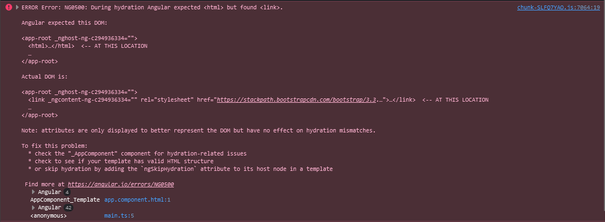
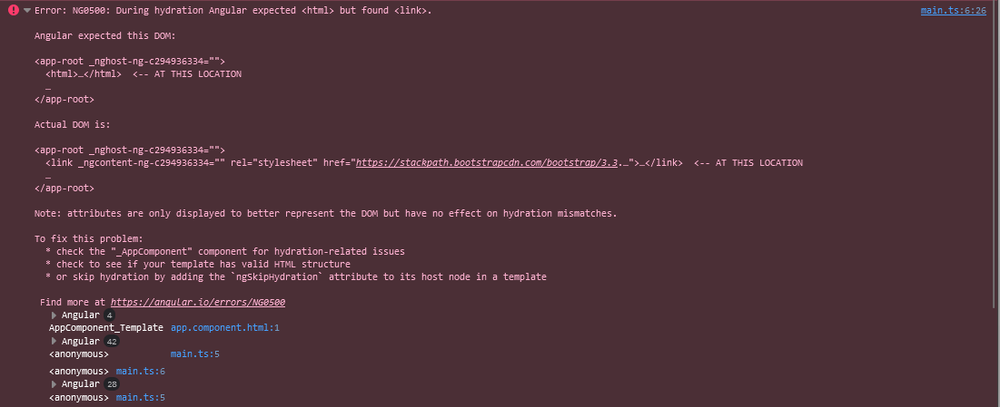

### Preface:
_During the project I had some issues when it came to running the buttonClicked(); function. After following the workshop directly and searching through docs I was still unable to come to a solution. Below I've included the two strange errors I kept seeing. I think the code for all the work is correct besides what is causing these weird errors..._

# Commands Used
---
+ ng new 
+ ng generate component
+ ng serve
---
+ npm install bootstrap --save
---
+ git init
+ git add -A
+ git commit -m 
+ git remote add origin "link to repo"
+ git push -f -u origin master
---